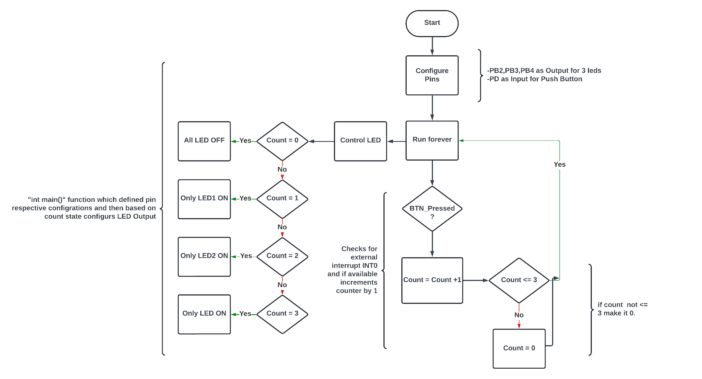
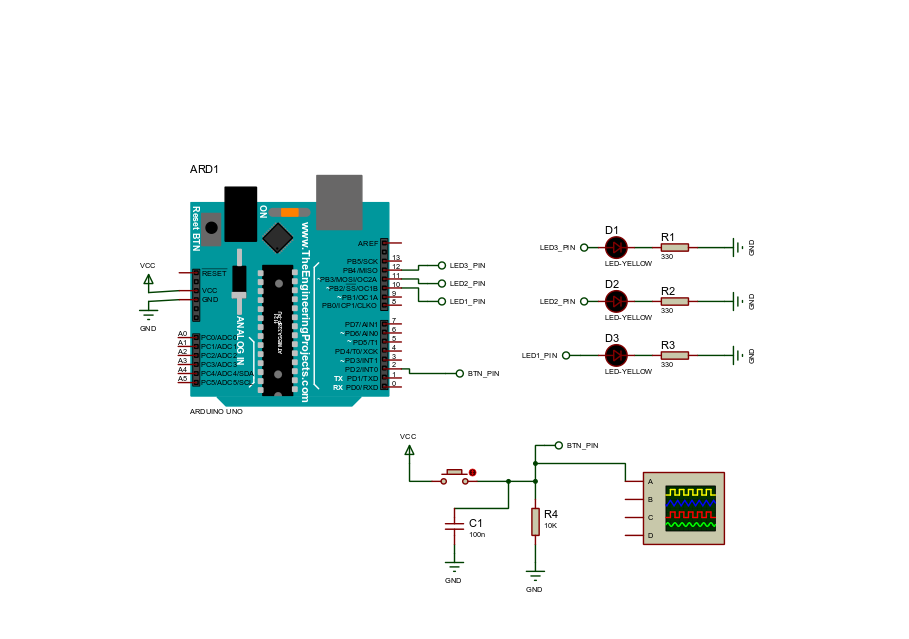

# Arduino Uno Button-Activated LED Sequence
## Description

This project demonstrates how to interface a push button with an Arduino Uno using External interrupt INTO, and sequentially control three LEDs using register-level programming. When the button is pressed, the LEDs light up one by one in a sequence. The code utilizes interrupts to handle button presses and avoid blocking the main loop.

## Flowchart 

## Setup
### Hardware Requirements

    Arduino Uno
    Three LEDs
    Push Button
    Resistors
    Breadboard and Jumper Wires

### Schematic

## Installation

To run this code on your Arduino Uno, follow these steps:

1. Download or clone this repository to your local machine.
2. Open the code file (led_sequence.ino) in the Arduino IDE.
3. Connect your Arduino Uno to your computer using a USB cable.
4. Select the appropriate board and port from the Arduino IDE's Tools menu.
5. Upload the code to your Arduino Uno.

## Code Explanation

The code utilizes register-level programming to configure pins and handle interrupts. Here's a brief explanation of the main functions:

- pin_config(): Configures pins for LEDs and the push button, and enables interrupts.
- control_led(): Controls the LEDs based on the button press count.
- ISR(INT0_vect): Interrupt service routine for handling button presses.
- btn_pressed(): Detects valid button presses while avoiding debounce effects.

For detailed code comments and explanations, refer to the source code file (led_sequence.ino).

